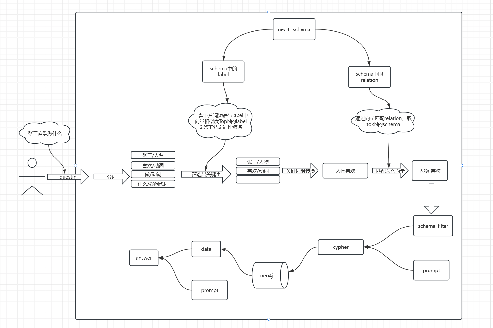

# 原理


# 运行环境
- java 17
- docker
- pgvector
- neo4j
- ollama(可以使用线上大模型api)

# 运行步骤

- 安装pgvector
```shell
docker pull pgvector/pgvector:pg16
docker run --name pgvector-text-to-cypher --restart=always -e POSTGRES_USER=pgvector -e POSTGRES_PASSWORD=12345678 -v ./data/:/var/lib/postgresql/data -p 5432:5432 -d pgvector/pgvector:pg16
```

- 安装neo4j
```shell
docker pull neo4j:4.4

   docker run -d --name neo4j-text-to-cypher -p 7474:7474 -p 7687:7687 -e NEO4J_AUTH=neo4j/12345678 -v ./data/:/data neo4j:4.4
   
```
- 执行db.sql数据库脚本
- 执行cypher语句
  
# 使用方法
访问接口
```shell
localhost:8080/text-to-cypher/chat/streamChat?query=张三喜欢做什么
```

# 详细使用方法
参考
- TextToCypherController.java
- TextToCypherApplicationTest.java

# 其他
- 项目背景
> 最近工作中需要做一个把文本知识转换为知识图谱并进行知识检索的项目，尝试了一些rag项目，效果不是很理想。我在总结前人经验的基础上完成了这个项目，目前感觉效果还不错，于是把问答模块单独抽取出来，
> 希望能够给其他同学提供一些参考。

- 其他的问题
> 1. 目前neo4j中的标签只支持中文
> 2. 查询节点的属性效果不是很好，如果有需要后面可以继续优化。
> 
- 最后说一句
- 如果你觉得这个项目对你有帮助，欢迎star一下，给我点鼓励，谢谢！